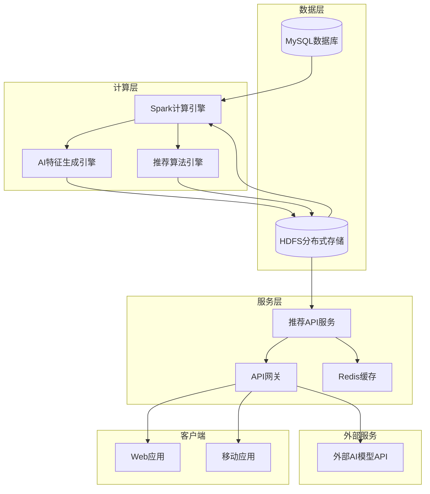
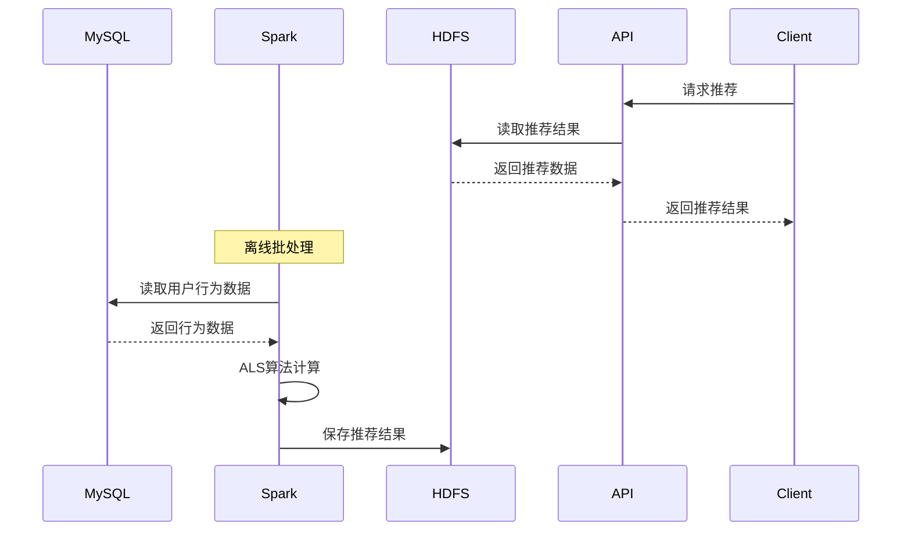
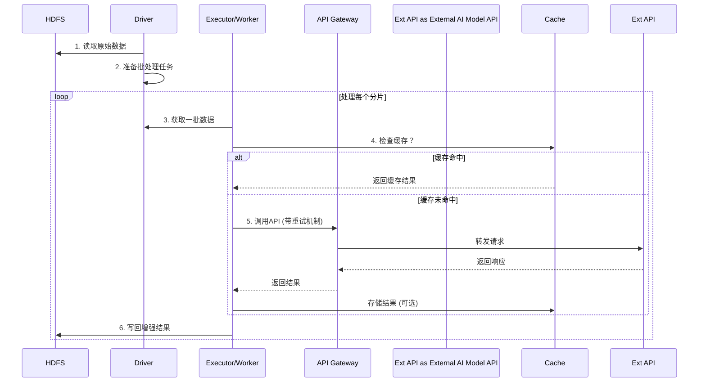
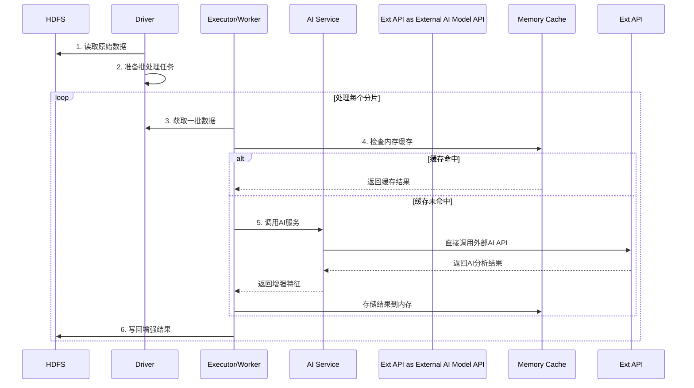
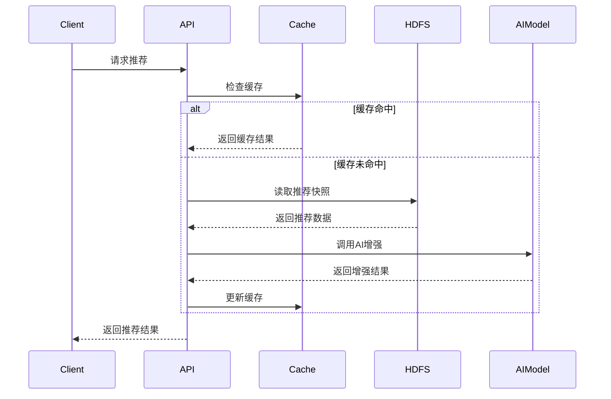
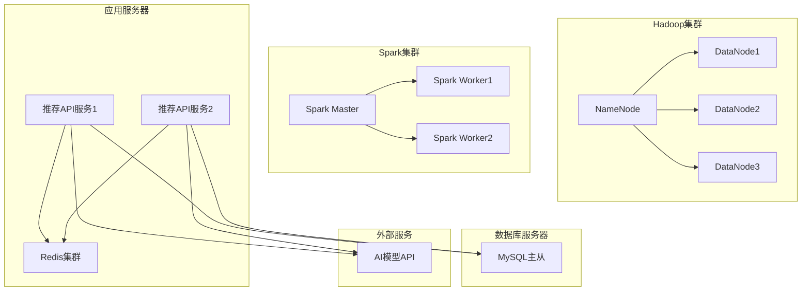
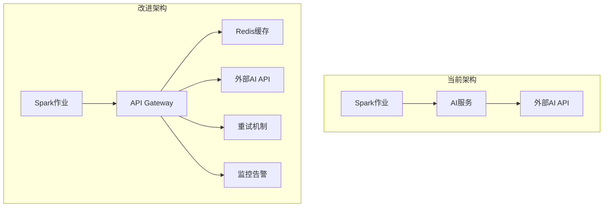
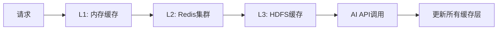

# 大数据与AI增强推荐系统技术文档

## 1. 系统概述

本系统是一个基于大数据和AI技术的推荐系统，采用混合架构设计，支持传统大数据推荐和AI增强推荐两种模式。系统通过HDFS存储数据，使用Spark进行分布式计算，集成外部AI模型API，并实现了完善的缓存和重试机制。

### 1.1 核心特性

- **双模式推荐**：支持传统大数据推荐和AI增强推荐
- **分布式计算**：基于Spark的分布式数据处理
- **智能缓存**：多级缓存机制提升性能
- **容错机制**：完善的错误处理和重试机制
- **实时API**：RESTful API支持实时推荐查询
- **可扩展性**：支持水平扩展和负载均衡

## 2. 系统架构

### 2.1 整体架构图



### 2.2 数据流架构

系统采用分层数据处理架构：

1. **数据采集层**：从MySQL数据库采集用户行为数据
2. **特征工程层**：使用AI模型生成用户和商品特征
3. **算法计算层**：基于ALS算法进行推荐计算
4. **结果存储层**：将推荐结果存储到HDFS
5. **服务提供层**：通过API服务提供推荐结果

## 3. 核心组件详解

### 3.1 大数据推荐引擎 (RecommendationEngine.scala)

**功能**：基于传统大数据技术的推荐系统核心引擎

**主要特性**：
- 使用ALS（交替最小二乘法）算法
- 支持冷启动策略
- 自动数据预处理和清洗
- 分布式计算支持

**核心参数**：
```scala
val als = new ALS()
  .setUserCol("user_id")
  .setItemCol("item_id")
  .setRatingCol("rating")
  .setRank(10)                    // 特征向量维度
  .setMaxIter(5)                  // 最大迭代次数
  .setRegParam(0.01)              // 正则化参数
  .setColdStartStrategy("drop")   // 冷启动策略
```

### 3.2 AI增强推荐引擎 (AIEnhancedRecommendationEngine.scala)

**功能**：集成AI特征的增强推荐引擎

**主要特性**：
- 集成AI生成的用户和商品特征
- 更高的推荐精度和个性化程度
- 支持AI特征回退机制
- 增强的模型参数配置

**核心参数**：
```scala
val als = new ALS()
  .setUserCol("user_id")
  .setItemCol("item_id")
  .setRatingCol("rating")
  .setRank(15)                    // 增加特征维度以利用AI特征
  .setMaxIter(10)                 // 增加迭代次数
  .setRegParam(0.01)
  .setColdStartStrategy("drop")
```

### 3.3 AI特征生成器 (AIFeatureGenerator.scala)

**功能**：调用外部AI模型生成用户和商品特征

**主要特性**：
- 调用阿里云百炼大模型进行行为分析
- 生成用户行为画像和商品特征
- 支持批量处理和并发控制
- 实现特征缓存和错误处理

**AI特征示例**：
```json
{
  "user_ai_profile": {
    "user_level": "high_value_user",
    "preference_pattern": "quality_focused",
    "engagement_score": 0.8,
    "quality_preference": 4.2,
    "ai_enhanced": true
  },
  "item_ai_features": {
    "popularity_tier": "high_popularity",
    "ai_popularity_score": 0.85,
    "recommendation_priority": 102.0,
    "ai_market_insights": true
  }
}
```

### 3.4 推荐API服务 (recommendation_api.py)

**功能**：提供RESTful API接口访问推荐结果

**主要端点**：
- `GET /recommendations/{user_id}` - 获取大数据推荐
- `GET /recommendations/ai/{user_id}` - 获取AI增强推荐
- `GET /ai_recommendations/{user_id}` - AI推荐专用端点
- `GET /stats` - 获取系统统计信息
- `GET /health` - 健康检查

**响应格式**：
```json
{
  "user_id": 123,
  "recommendations": [1, 5, 8, 12, 15],
  "algorithm": "als_with_ai_enhancement",
  "type": "ai_enhanced",
  "ai_model_version": "bailian-ai-enhanced-v2.0",
  "ai_enhanced": true,
  "generated_at": "2024-01-15T10:30:00",
  "expires_at": "2024-01-22T10:30:00"
}
```

### 3.5 缓存系统

**多层缓存架构**：

1. **内存缓存**：服务层本地缓存，TTL=20-30分钟
2. **Redis缓存**：分布式缓存，支持集群部署
3. **HDFS缓存**：计算结果缓存，支持增量更新

**缓存策略**：
- 大数据推荐：TTL=20分钟（相对稳定）
- AI增强推荐：TTL=30分钟（计算成本高）
- 用户行为：TTL=5分钟（实时性要求高）

## 4. 数据处理流程

### 4.1 大数据推荐流程



### 4.2 AI增强推荐流程

**理想架构序列图**：


**当前实现序列图**：


**架构对比分析**：
- **理想架构**：通过API Gateway统一管理外部API调用，支持分布式缓存和增强的重试机制
- **当前实现**：直接调用外部AI API，使用内存缓存，架构相对简单
- **改进方向**：可考虑引入API Gateway层来提升系统的可维护性和扩展性

### 4.3 实时推荐流程



## 5. 部署架构

### 5.1 系统环境要求

**基础环境**：
- Java 8+
- Scala 2.12
- Spark 3.x
- Hadoop 3.x
- Python 3.8+

**数据库**：
- MySQL 8.0+
- Redis 6.0+

**外部服务**：
- 阿里云百炼大模型API
- 讯飞星火大模型API

### 5.2 部署拓扑



### 5.3 配置文件

**Spark配置** (`spark-defaults.conf`)：
```properties
spark.sql.adaptive.enabled=true
spark.sql.adaptive.coalescePartitions.enabled=true
spark.serializer=org.apache.spark.serializer.KryoSerializer
spark.sql.adaptive.skewJoin.enabled=true
spark.sql.adaptive.localShuffleReader.enabled=true
```

**Hadoop配置** (`core-site.xml`)：
```xml
<configuration>
    <property>
        <name>fs.defaultFS</name>
        <value>hdfs://hadoop01:9000</value>
    </property>
</configuration>
```

## 6. 性能优化

### 6.1 计算优化

**Spark优化**：
- 使用自适应查询执行（AQE）
- 合理设置分区数量
- 启用列式存储和压缩
- 使用广播变量减少数据传输

**算法优化**：
- ALS算法参数调优
- 特征向量维度优化
- 迭代次数和收敛条件调整

### 6.2 存储优化

**HDFS优化**：
- 启用数据压缩（Snappy/LZ4）
- 合理设置副本数量
- 使用列式存储格式（Parquet）

**缓存优化**：
- 多级缓存策略
- 智能缓存失效
- 缓存预热机制

### 6.3 网络优化

**API优化**：
- 连接池管理
- 请求超时设置
- 重试机制和熔断器

## 7. 监控与运维

### 7.1 监控指标

**系统指标**：
- CPU使用率
- 内存使用率
- 磁盘I/O
- 网络带宽

**业务指标**：
- 推荐准确率
- 响应时间
- 缓存命中率
- API调用成功率

**Spark指标**：
- 作业执行时间
- 任务失败率
- 数据倾斜情况
- 资源利用率

### 7.2 日志管理

**日志级别**：
- ERROR：系统错误和异常
- WARN：警告信息
- INFO：关键操作信息
- DEBUG：详细调试信息

**日志收集**：
- 使用ELK Stack收集和分析日志
- 设置日志轮转和清理策略
- 实现日志告警机制

### 7.3 故障处理

**常见故障**：
1. **HDFS连接失败**：检查网络和Hadoop服务状态
2. **Spark作业失败**：检查资源分配和任务配置
3. **AI API调用失败**：检查API密钥和网络连接
4. **缓存失效**：检查Redis服务状态

**故障恢复**：
- 自动重试机制
- 降级策略（回退到基础推荐）
- 数据备份和恢复

## 8. 安全考虑

### 8.1 数据安全

**数据加密**：
- 传输加密（HTTPS/TLS）
- 存储加密（HDFS透明加密）
- 敏感数据脱敏

**访问控制**：
- 基于角色的访问控制（RBAC）
- API访问令牌验证
- 数据库连接加密

### 8.2 系统安全

**网络安全**：
- 防火墙配置
- VPN访问控制
- 端口访问限制

**应用安全**：
- 输入验证和过滤
- SQL注入防护
- XSS攻击防护

## 9. 扩展性设计

### 9.1 水平扩展

**计算扩展**：
- 增加Spark Worker节点
- 动态资源分配
- 负载均衡

**存储扩展**：
- 增加HDFS DataNode
- 数据分片策略
- 跨数据中心复制

### 9.2 功能扩展

**算法扩展**：
- 支持更多推荐算法
- 实时推荐算法
- 深度学习模型集成

**数据源扩展**：
- 支持更多数据源
- 实时数据流处理
- 多租户数据隔离

## 10. 架构改进建议

### 10.1 添加API Gateway层

建议添加独立的API Gateway层来统一管理外部API调用：

**架构改进方案**：


**实现建议**：
1. **独立API Gateway服务**：使用Spring Cloud Gateway或Kong
2. **统一API管理**：集中管理所有外部API调用
3. **增强重试机制**：指数退避、熔断器模式
4. **监控和告警**：API调用成功率、响应时间监控

### 10.2 缓存架构优化

**当前缓存架构**：
- 内存缓存（服务层）
- Redis缓存（可选）
- HDFS缓存（计算结果）

**优化建议**：


### 10.3 容错机制增强

**当前容错**：
- 基本异常处理
- 简单重试机制
- 降级到基础推荐

**增强建议**：
- 熔断器模式（Circuit Breaker）
- 限流和背压控制
- 多级降级策略
- 健康检查和自动恢复

## 11. 总结

本系统成功实现了大数据和AI技术的深度融合，通过分层架构设计、智能缓存机制和完善的容错处理，构建了一个高性能、高可用的推荐系统。系统支持传统大数据推荐和AI增强推荐两种模式，能够根据实际需求灵活切换，为用户提供个性化的推荐服务。

**主要优势**：
1. **高性能**：分布式计算和智能缓存提升系统性能
2. **高可用**：完善的容错机制和降级策略
3. **可扩展**：支持水平扩展和功能扩展
4. **智能化**：AI技术增强推荐精度和个性化程度
5. **易维护**：完善的监控和日志系统

**技术亮点**：
- 混合推荐架构设计
- 多级缓存优化策略
- 智能特征工程
- 完善的API服务
- 全面的监控体系

该系统为推荐系统的发展提供了重要的技术参考，展示了大数据和AI技术在实际业务场景中的成功应用。
