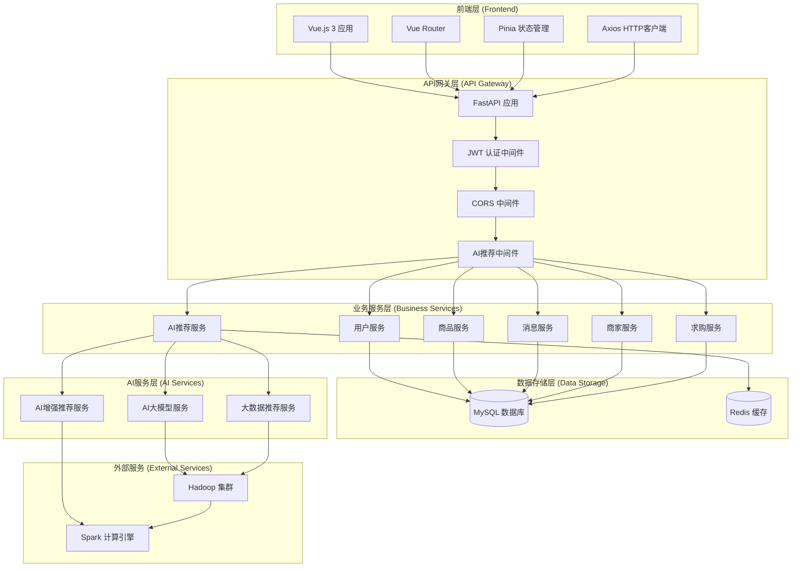
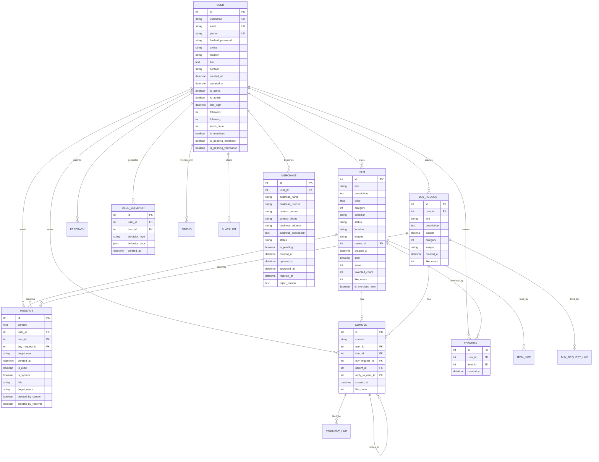

# 《技术方案说明书 (Tech Spec)》

---

## 1   系统架构 (System Architecture)

### 1.1   架构概述
校园二手交易平台采用前后端分离的微服务架构，基于FastAPI构建现代化后端API服务，前端使用Vue.js 3构建响应式单页应用。系统集成了多种AI智能推荐系统，包括AI大模型、大数据推荐和AI增强推荐功能，为用户提供智能化的商品推荐和交易体验。

**技术栈选型：**
- **后端**: FastAPI + SQLAlchemy + MySQL + Redis
- **前端**: Vue.js 3 + Vue Router + Pinia + Vite
- **AI服务**: AI大模型 + Hadoop + Spark
- **实时通信**: WebSocket
- **缓存**: Redis
- **数据库**: MySQL 8.0

### 1.2   系统架构图



---

## 2   数据模型 (Data Model)

### 2.1   核心实体 (Core Entities)
- **用户 (User)**: 系统用户，包含个人资料、认证信息、社交关系
- **商品 (Item)**: 二手商品信息，包含标题、描述、价格、图片等
- **消息 (Message)**: 用户间通信消息，支持私聊和系统消息
- **求购 (BuyRequest)**: 用户发布的求购信息
- **评论 (Comment)**: 商品和求购的评论系统
- **收藏 (Favorite)**: 用户收藏的商品
- **好友 (Friend)**: 用户好友关系
- **黑名单 (Blacklist)**: 用户黑名单管理
- **商家 (Merchant)**: 商家认证信息
- **反馈 (Feedback)**: 用户反馈和建议
- **用户行为 (UserBehavior)**: 用户行为数据，用于AI推荐分析
- **AI推荐配置 (AIRecommendationConfig)**: AI推荐系统配置

### 2.2   实体关系图 (ERD)



---

## 3   核心API约定 (API Contract)

### 3.1   接口一：用户认证
* **请求方法：** `POST`
* **请求路径：** `/api/v1/auth/login`
* **请求数据结构 (JSON)：**
    ```json
    {
      "username": "user123",
      "password": "password123"
    }
    ```
* **响应数据结构 (JSON)：**
    ```json
    {
      "access_token": "eyJhbGciOiJIUzI1NiIsInR5cCI6IkpXVCJ9...",
      "token_type": "bearer",
      "user": {
        "id": 1,
        "username": "user123",
        "email": "user@example.com",
        "is_admin": false
      }
    }
    ```

### 3.2   接口二：获取商品列表
* **请求方法：** `GET`
* **请求路径：** `/api/v1/items`
* **查询参数：**
    - `skip`: 分页偏移量 (默认: 0)
    - `limit`: 每页数量 (默认: 10)
    - `category`: 商品分类
    - `search`: 搜索关键词
* **响应数据结构 (JSON)：**
    ```json
    {
      "items": [
        {
          "id": 1,
          "title": "二手iPhone 13",
          "description": "九成新，无磕碰",
          "price": 3500.0,
          "category": 1,
          "condition": "excellent",
          "location": "北京",
          "image_urls": ["http://example.com/image1.jpg"],
          "owner": {
            "id": 1,
            "username": "seller123"
          },
          "created_at": "2024-12-19T10:00:00Z",
          "views": 150,
          "like_count": 25
        }
      ],
      "total": 100,
      "page": 1,
      "pages": 10
    }
    ```

### 3.3   接口三：发布商品
* **请求方法：** `POST`
* **请求路径：** `/api/v1/items`
* **请求数据结构 (JSON)：**
    ```json
    {
      "title": "二手MacBook Pro",
      "description": "2022款，M2芯片，16GB内存",
      "price": 8000.0,
      "category": 2,
      "condition": "excellent",
      "location": "上海",
      "images": ["image1.jpg", "image2.jpg"]
    }
    ```
* **响应数据结构 (JSON)：**
    ```json
    {
      "id": 123,
      "title": "二手MacBook Pro",
      "description": "2022款，M2芯片，16GB内存",
      "price": 8000.0,
      "category": 2,
      "condition": "excellent",
      "status": "online",
      "location": "上海",
      "image_urls": ["http://example.com/image1.jpg"],
      "owner_id": 1,
      "created_at": "2024-12-19T10:00:00Z",
      "views": 0,
      "like_count": 0
    }
    ```

### 3.4   接口四：AI智能推荐
* **请求方法：** `GET`
* **请求路径：** `/api/v1/ai_strategy/recommendations`
* **查询参数：**
    - `limit`: 推荐数量 (默认: 10)
* **响应数据结构 (JSON)：**
    ```json
    {
      "success": true,
      "recommendations": [
        {
          "id": 1,
          "title": "推荐商品标题",
          "description": "商品描述",
          "price": 1000.0,
          "category": 1,
          "condition": "good",
          "location": "北京",
          "image_urls": ["http://example.com/image.jpg"],
          "ai_reason": "基于您的浏览历史推荐",
          "created_at": "2024-12-19T10:00:00Z",
          "views": 50,
          "like_count": 10
        }
      ],
      "analysis": "基于您的浏览行为分析，推荐以下商品",
      "market_insights": "当前市场趋势分析",
      "recommendation_type": "ai_behavior_based"
    }
    ```

### 3.5   接口五：发送消息
* **请求方法：** `POST`
* **请求路径：** `/api/v1/messages`
* **请求数据结构 (JSON)：**
    ```json
    {
      "content": "你好，这个商品还在吗？",
      "item_id": 123,
      "target_user": "seller123"
    }
    ```
* **响应数据结构 (JSON)：**
    ```json
    {
      "id": 456,
      "content": "你好，这个商品还在吗？",
      "user_id": 1,
      "item_id": 123,
      "target_user": "seller123",
      "created_at": "2024-12-19T10:00:00Z",
      "is_read": false
    }
    ```

### 3.6   接口六：获取用户行为统计
* **请求方法：** `GET`
* **请求路径：** `/api/v1/ai_strategy/behavior-stats`
* **查询参数：**
    - `days`: 统计天数 (默认: 30)
* **响应数据结构 (JSON)：**
    ```json
    {
      "success": true,
      "stats": {
        "total_behaviors": 150,
        "view_count": 80,
        "click_count": 45,
        "favorite_count": 15,
        "search_count": 10,
        "behavior_types": {
          "view": 80,
          "click": 45,
          "favorite": 15,
          "search": 10
        }
      },
      "period_days": 30
    }
    ```

---

## 4   项目概述

### 4.1   项目背景
校园二手交易平台是一个基于现代化Web技术栈构建的综合性二手商品交易系统，专门为校园用户设计。平台集成了多种AI智能推荐系统，包括AI大模型、大数据推荐和AI增强推荐功能，提供智能化的商品识别、价格分析和推荐服务。

### 4.2   项目目标
- 为校园用户提供安全、便捷的二手商品交易平台
- 通过AI技术提升用户体验和交易效率
- 构建完整的用户社交和交易生态系统
- 实现响应式设计，支持多端访问

### 4.3   核心特色
- 🤖 **AI智能推荐** - 基于AI大模型的智能商品识别和价格分析
- 💬 **实时聊天系统** - 支持用户间实时沟通和交易协商
- 📱 **响应式设计** - 完美适配PC端和移动端
- 🔍 **智能搜索** - 支持多维度商品搜索和筛选
- 👥 **社交功能** - 好友系统、关注机制、评论互动

---

## 5   AI智能推荐系统

### 5.1   AI功能概述
平台集成了多种AI智能推荐系统，提供以下AI功能：

#### 核心功能
- **商品图片识别**: 自动识别商品类型、品牌、型号
- **信息自动补全**: 基于图片自动填充商品信息
- **价格智能分析**: 分析市场价格竞争力
- **低价好物推荐**: 推荐性价比最高的商品
- **个性化推荐**: 基于用户行为序列的智能分析
- **市场洞察**: 提供商品价格分析和市场趋势

### 5.2   AI技术实现

#### AI大模型API集成
```python
class AIService:
    def __init__(self):
        self.app_id = os.getenv("AI_APP_ID")
        self.api_key = os.getenv("AI_API_KEY")
        self.api_secret = os.getenv("AI_API_SECRET")
        self.model_url = os.getenv("AI_MODEL_URL")
    
    def auto_complete_item_by_image(self, image_bytes_list: list) -> dict:
        """通过图片调用AI大模型自动补全商品信息"""
        
    def analyze_price_competition(self, current_items: List[Dict]) -> Dict:
        """分析当前网站商品的价格竞争力"""
```

#### AI功能流程
1. **图片上传**: 用户上传1-4张商品图片
2. **AI识别**: 调用AI大模型进行图片识别
3. **信息提取**: 提取商品类型、品牌、型号等信息
4. **价格分析**: 分析市场价格和竞争力
5. **结果返回**: 返回结构化的商品信息

### 5.3   AI配置参数
```python
# AI大模型配置
AI_APP_ID: str = os.getenv("AI_APP_ID", "")
AI_API_KEY: str = os.getenv("AI_API_KEY", "")
AI_API_SECRET: str = os.getenv("AI_API_SECRET", "")
AI_MODEL_URL: str = os.getenv("AI_MODEL_URL", "")
```

### 5.4   AI功能优势
- **提升效率**: 减少用户手动输入时间
- **提高准确性**: AI识别减少人为错误
- **智能推荐**: 基于数据分析的智能推荐
- **用户体验**: 简化商品发布流程
- **多算法融合**: 结合多种推荐算法，提供更精准的推荐

---

## 6   前端架构

### 6.1   前端技术栈
- **Vue.js 3**: 渐进式JavaScript框架
- **Vue Router 4**: 前端路由管理
- **Pinia**: 状态管理库
- **Axios**: HTTP客户端
- **Vite**: 现代化构建工具

### 6.2   组件架构
```
src/
├── components/          # 通用组件
│   ├── SearchBar.vue    # 搜索栏
│   ├── ProductCard.vue  # 商品卡片
│   ├── BottomNav.vue    # 底部导航
│   ├── CommentSection.vue # 评论区域
│   └── ImagePreview.vue # 图片预览
├── views/               # 页面组件
│   ├── Home.vue         # 首页
│   ├── LoginRegister.vue # 登录注册
│   ├── PublishItem.vue  # 发布商品
│   ├── ItemDetail.vue   # 商品详情
│   ├── Chat.vue         # 聊天页面
│   ├── Profile.vue      # 个人中心
│   └── Admin.vue        # 管理后台
├── services/            # 服务层
│   └── api.js           # API接口
├── store/               # 状态管理
│   └── auth.js          # 认证状态
└── router/              # 路由配置
    └── index.js         # 路由定义
```

### 6.3   响应式设计
- **移动优先**: 优先适配移动端体验
- **断点设计**: 支持多种屏幕尺寸
- **触摸优化**: 针对触摸操作优化
- **性能优化**: 图片懒加载、组件懒加载

### 6.4   用户体验设计
- **直观导航**: 清晰的导航结构
- **快速操作**: 一键发布、快速搜索
- **实时反馈**: 操作状态实时反馈
- **错误处理**: 友好的错误提示

---

## 7   安全机制

### 7.1   认证安全
- **JWT Token**: 基于Token的无状态认证
- **密码加密**: bcrypt算法加密存储
- **Token过期**: 自动Token刷新机制
- **会话管理**: 安全的会话控制

### 7.2   数据安全
- **输入验证**: 严格的输入数据验证
- **SQL注入防护**: ORM防止SQL注入
- **XSS防护**: 输出数据转义
- **CSRF防护**: 跨站请求伪造防护

### 7.3   文件安全
- **文件类型验证**: 限制上传文件类型
- **文件大小限制**: 防止大文件攻击
- **路径安全**: 安全的文件存储路径
- **访问控制**: 文件访问权限控制

---

## 8   性能优化

### 8.1   后端优化
- **数据库连接池**: 优化数据库连接
- **查询优化**: 索引优化和查询缓存
- **异步处理**: 非阻塞异步操作
- **API缓存**: Redis缓存热点数据
- **并发控制**: 支持高并发AI请求处理
- **限流保护**: 防止恶意请求，保护系统稳定

### 8.2   前端优化
- **代码分割**: 按需加载组件
- **图片优化**: 图片压缩和懒加载
- **缓存策略**: 浏览器缓存优化
- **CDN加速**: 静态资源CDN分发

### 8.3   网络优化
- **HTTP/2**: 支持HTTP/2协议
- **Gzip压缩**: 响应数据压缩
- **资源合并**: CSS/JS文件合并
- **缓存控制**: 合理的缓存策略

---

## 9   部署方案

### 9.1   开发环境
```bash
# 后端启动
python main.py

# 前端启动
cd frontend
npm run dev
```

### 9.2   生产环境部署

#### Docker部署
```dockerfile
# 后端Dockerfile
FROM python:3.9-slim
WORKDIR /app
COPY requirements.txt .
RUN pip install -r requirements.txt
COPY . .
CMD ["uvicorn", "main:app", "--host", "0.0.0.0", "--port", "8000"]
```

#### 服务器配置
- **操作系统**: Ubuntu 20.04 LTS
- **Web服务器**: Nginx
- **应用服务器**: Gunicorn + Uvicorn
- **数据库**: MySQL 8.0
- **缓存**: Redis

### 9.3   环境变量配置
```bash
# 数据库配置
MYSQL_USER=root
MYSQL_PASSWORD=your_password
MYSQL_SERVER=localhost
MYSQL_PORT=3306
MYSQL_DB=ershou

# 安全配置
SECRET_KEY=your-secret-key
ALGORITHM=HS256
ACCESS_TOKEN_EXPIRE_MINUTES=10080

# AI服务配置
AI_APP_ID=your-app-id
AI_API_KEY=your-api-key
AI_API_SECRET=your-api-secret
AI_MODEL_URL=your-model-url
```

---

## 10   监控与维护

### 10.1   日志管理
- **应用日志**: 记录应用运行状态
- **错误日志**: 记录异常和错误信息
- **访问日志**: 记录API访问情况
- **性能日志**: 记录性能指标

### 10.2   监控指标
- **系统性能**: CPU、内存、磁盘使用率
- **应用性能**: 响应时间、吞吐量
- **数据库性能**: 查询时间、连接数
- **用户行为**: 访问量、转化率
- **AI推荐统计**: 推荐请求数、成功率、响应时间

### 10.3   备份策略
- **数据库备份**: 定期全量备份
- **文件备份**: 用户上传文件备份
- **配置备份**: 系统配置文件备份
- **灾难恢复**: 完整的恢复方案

---

## 11   扩展性设计

### 11.1   水平扩展
- **负载均衡**: Nginx负载均衡
- **数据库分片**: 支持数据库水平分片
- **缓存集群**: Redis集群部署
- **微服务拆分**: 支持服务拆分

### 11.2   功能扩展
- **支付集成**: 支持多种支付方式
- **物流集成**: 物流信息跟踪
- **第三方登录**: 微信、QQ等登录
- **消息推送**: 实时消息推送

### 11.3   技术升级
- **框架升级**: 支持技术栈升级
- **数据库迁移**: 支持数据库迁移
- **API版本**: 支持API版本管理
- **向后兼容**: 保持向后兼容性

---

## 12   项目特色与创新

### 12.1   AI智能推荐
- **图片识别**: 基于AI的商品图片识别
- **智能定价**: AI辅助价格分析
- **个性化推荐**: 基于用户行为的推荐
- **市场洞察**: AI分析市场趋势
- **多层级推荐**: AI大模型、大数据推荐、AI增强推荐

### 12.2   社交化交易
- **好友系统**: 用户好友关系管理
- **关注机制**: 用户关注和粉丝系统
- **评论互动**: 商品评论和回复
- **私信聊天**: 用户间私信沟通

### 12.3   用户体验优化
- **响应式设计**: 完美适配多端
- **实时通信**: WebSocket实时消息
- **智能搜索**: 多维度搜索功能
- **一键发布**: 简化商品发布流程

---

## 13   风险评估与应对

### 13.1   技术风险
- **AI服务依赖**: 第三方AI服务稳定性
- **数据安全**: 用户数据泄露风险
- **性能瓶颈**: 高并发访问压力
- **技术债务**: 代码维护成本

### 13.2   应对策略
- **服务降级**: AI服务不可用时的降级方案
- **数据加密**: 敏感数据加密存储
- **性能优化**: 持续的性能监控和优化
- **代码重构**: 定期的代码重构和维护

---

## 14   项目总结

### 14.1   技术亮点
1. **现代化技术栈**: 采用最新的Web技术栈
2. **AI智能集成**: 深度集成多种AI功能
3. **响应式设计**: 完美适配多端设备
4. **实时通信**: 支持实时消息交互
5. **安全可靠**: 完善的安全机制
6. **高性能**: 支持高并发和缓存优化

### 14.2   商业价值
1. **用户价值**: 提供便捷的二手交易平台
2. **技术价值**: 展示AI技术在电商领域的应用
3. **社会价值**: 促进校园资源循环利用
4. **创新价值**: 创新的AI+电商模式

### 14.3   发展前景
1. **功能扩展**: 支持更多交易场景
2. **技术升级**: 持续的技术优化和升级
3. **用户增长**: 扩大用户群体和市场份额
4. **生态建设**: 构建完整的交易生态系统

---

**文档版本**: v2.0  
**最后更新**: 2024年12月  
**编写人员**: 技术团队  
**审核人员**: 项目经理
