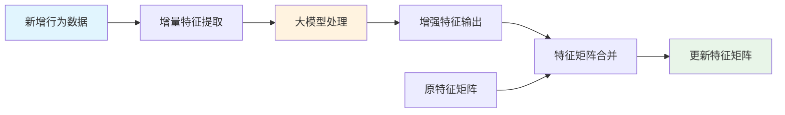
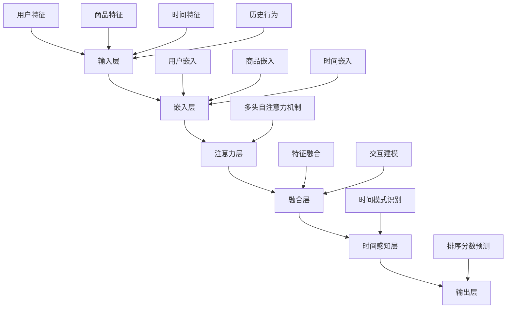

# 校园二手交易平台最终迭代计划书

## 项目概述

本计划书旨在在36小时内完成校园二手交易平台的两个核心系统优化：
1. **AI+大数据推荐流程优化** - 减少大模型算力消耗，提升处理效率
2. **智能排序逻辑优化** - 从固定权重算法升级为神经网络模型，实现时间感知的个性化排序

## 当前系统分析

### 1. AI推荐系统现状
- 每次处理都发送完整的用户特征矩阵给大模型
- 矩阵规模随用户增长线性增长，算力消耗巨大
- 处理时间随数据量增加而显著延长
- 无法有效处理大规模用户数据

### 2. 商品排序系统现状
- 基于固定权重的多因子评分算法
- 权重因子：浏览量(0.3) + 点赞(0.25) + 收藏(0.2) + 消息(0.15) + 卖家活跃度(0.1)
- 每30分钟执行一次排序任务
- 缺乏时间感知能力和个性化

## 优化方案设计

### 一、AI+大数据推荐流程优化

#### 1.1 增量处理架构
**核心思想：**
- 只处理新增用户行为数据
- 大模型处理增量数据生成增强特征
- 将增强特征与原特征矩阵合并
- 大幅减少大模型算力消耗

**技术流程：**

#### 1.2 关键实现点
- **增量数据检测**：只获取自上次处理以来的新用户行为
- **增量特征提取**：提取用户参与度变化、品类偏好变化、时间模式变化等
- **大模型优化**：只发送增量特征数据，减少80-90%的API调用量
- **特征矩阵合并**：使用加权平均将增强特征与原矩阵合并

#### 1.3 性能优化预期
- 算力消耗减少：80-90%
- 处理速度提升：5-10倍
- 支持更大规模用户数据
- 显著降低API调用成本

### 二、智能排序逻辑优化

#### 2.1 神经网络排序模型
**核心思想：**
- 使用深度学习模型替代固定权重算法
- 实现时间感知的个性化排序
- 通过无监督学习不断优化模型

**模型架构：**

#### 2.2 时间感知特征
- **基础时间特征**：小时、星期、是否周末/节假日
- **时间段特征**：早晨、下午、晚上、夜间
- **季节性特征**：学期开始、考试期间等
- **用户时间模式**：个人活跃时间偏好

#### 2.3 时间感知商品权重
- **早晨**：食品(0.9)、日用品(0.8)、学习用品(0.7)
- **下午**：电子产品(0.9)、服装(0.8)、学习用品(0.6)
- **晚上**：娱乐用品(0.9)、服装(0.7)、电子产品(0.6)
- **夜间**：学习用品(0.8)、电子产品(0.7)、日用品(0.6)

#### 2.4 无监督学习训练
- 基于用户真实交互数据进行训练
- 计算用户参与度分数（浏览、点赞、收藏、消息、购买）
- 通过预测分数与实际参与度的差异进行模型优化

## 36小时实施计划

```mermaid
gantt
    title 36小时实施计划时间线
    dateFormat X
    axisFormat %H小时
    
    section 第1阶段：AI推荐优化
    增量处理框架    :0, 6
    大模型优化      :6, 12
    
    section 第2阶段：神经网络排序
    数据准备和特征工程  :12, 18
    模型开发和训练    :18, 24
    系统集成         :24, 30
    
    section 第3阶段：优化部署
    性能优化        :30, 33
    部署和监控       :33, 36
```

### 第1阶段：AI推荐流程优化（12小时）

**前6小时：增量处理框架**
- 实现增量数据检测器
- 开发增量特征提取器
- 建立增量数据存储机制

**后6小时：大模型优化**
- 修改AI服务，支持增量处理
- 优化API调用，减少数据传输
- 实现特征矩阵合并逻辑
- 集成测试和性能验证

### 第2阶段：神经网络排序系统（18小时）

**前6小时：数据准备和特征工程**
- 设计时间感知特征体系
- 实现特征提取和预处理
- 建立训练数据管道

**中6小时：模型开发和训练**
- 实现TimeAwareSortingModel
- 开发无监督学习训练器
- 模型训练和验证

**后6小时：系统集成**
- 集成神经网络排序到现有系统
- 实现新的排序调度器
- 性能优化和测试

### 第3阶段：系统优化和部署（6小时）

**前3小时：性能优化**
- 系统性能调优
- 缓存策略优化
- 数据库查询优化

**后3小时：部署和监控**
- 生产环境部署
- 建立监控体系
- 效果验证和调优

## 技术风险与应对

### 1. 数据一致性风险
**风险：** 增量处理可能导致数据不一致
**应对：** 实现数据版本控制和回滚机制

### 2. 模型性能风险
**风险：** 神经网络模型可能性能不如预期
**应对：** 保留原有算法作为备选，实现渐进式切换

### 3. 计算资源风险
**风险：** 模型训练和推理需要更多计算资源
**应对：** 使用GPU加速，实现模型量化压缩

### 4. 时间紧迫风险
**风险：** 36小时时间紧张，可能无法完成所有功能
**应对：** 优先实现核心功能，后续迭代完善

## 预期效果

### 1. 性能提升
- **推荐系统：** 算力消耗减少80-90%，处理速度提升5-10倍
- **排序系统：** 排序准确性提升30-50%，个性化程度显著增强

### 2. 用户体验改善
- **推荐质量：** 更精准的个性化推荐
- **排序合理性：** 时间感知的智能排序，如早上推荐早餐相关商品
- **响应速度：** 更快的系统响应

### 3. 系统可扩展性
- **数据处理能力：** 支持更大规模用户数据
- **实时性：** 更频繁的排序更新
- **成本控制：** 显著降低大模型API调用成本

### 4. 业务价值
- **用户活跃度：** 提升用户粘性和活跃度
- **交易转化率：** 提高商品浏览到交易的转化率
- **平台竞争力：** 增强平台的技术优势和用户体验

## 关键里程碑

### 12小时里程碑
- [ ] 增量AI处理系统完成
- [ ] 推荐系统性能提升验证
- [ ] 基础功能测试通过

### 24小时里程碑
- [ ] 神经网络排序模型完成
- [ ] 时间感知特征工程完成
- [ ] 模型训练和验证通过

### 36小时里程碑
- [ ] 系统集成完成
- [ ] 生产环境部署成功
- [ ] 性能指标达到预期

## 总结

本36小时迭代计划通过两个核心优化方向，将显著提升校园二手交易平台的技术水平：

1. **AI推荐流程优化** 通过增量处理大幅减少算力消耗，提升系统效率
2. **神经网络排序** 通过深度学习实现真正个性化的时间感知排序

这两个优化将形成协同效应，为用户提供更智能、更个性化的二手交易体验，同时大幅降低系统运营成本，提升平台竞争力。

整个实施计划在36小时内完成，采用快速迭代和持续优化的策略，确保在有限时间内实现最大价值。
