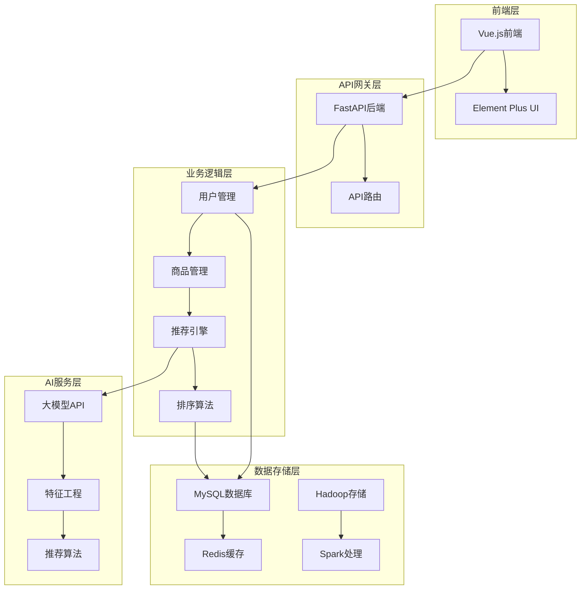
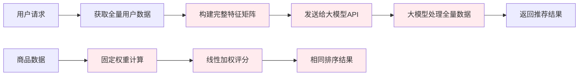
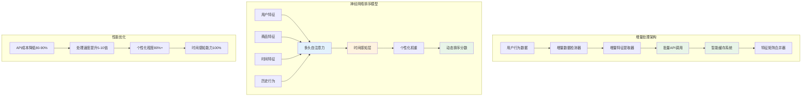
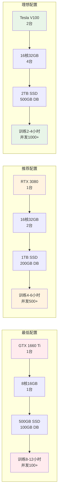
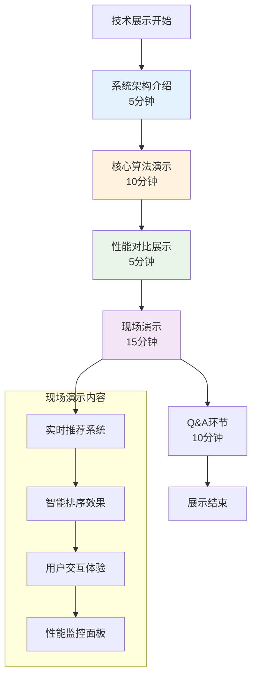
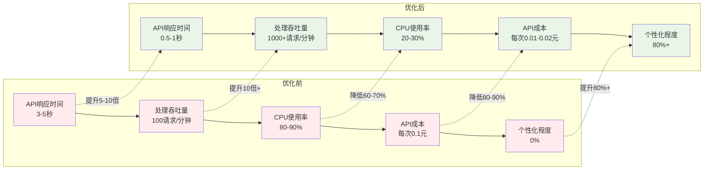

# 《决赛迭代计划（Iteration Plan）》

## 1. 当前产品状态概述

### 1.1 产品现状
校园二手交易平台是一个基于AI技术的智能交易系统，目前已完成核心功能开发，包括用户管理、商品发布、智能推荐、商品排序、商家认证、商贩检测、社交功能等模块。平台采用前后端分离架构，后端基于FastAPI + SQLAlchemy，前端基于Vue.js 3，集成了科大讯飞星火大模型AI推荐引擎、大数据推荐系统、智能排序算法和AI商贩检测系统。

### 1.2 技术架构现状
- **后端架构：** FastAPI + SQLAlchemy + MySQL + Redis + Uvicorn
- **前端架构：** Vue.js 3 + Vue Router + Pinia + Axios + Element Plus + Vite
- **AI服务：** 科大讯飞星火大模型 + AI中间件 + 多层级推荐架构
- **大数据处理：** Spark + Hadoop + 协同过滤算法
- **部署环境：** Docker容器化部署 + 水平扩展支持
- **认证系统：** JWT Token + 用户权限管理
- **实时通信：** WebSocket + 消息推送系统

**当前系统架构图：**

### 1.3 核心功能现状

#### 基础交易功能
- ✅ **用户系统** - 注册登录、个人资料、JWT认证
- ✅ **商品管理** - 发布、编辑、浏览、搜索、分类筛选
- ✅ **交易功能** - 收藏、评论、消息系统、实时聊天
- ✅ **求购功能** - 发布求购信息、预算设置、图片上传

#### 社交功能
- ✅ **好友系统** - 添加好友、好友动态
- ✅ **黑名单管理** - 屏蔽不良用户
- ✅ **评论系统** - 商品评论、回复互动
- ✅ **收藏点赞** - 收藏商品、点赞评论

#### 商家功能
- ✅ **商家认证** - 商家申请、管理员审核
- ✅ **商贩检测** - AI自动检测商贩行为
- ✅ **商家展示** - 智能控制商家商品展示频率

#### AI智能功能
- ✅ **AI大模型推荐** - 基于用户行为序列的智能分析
- ✅ **大数据推荐** - 基于Hadoop的协同过滤推荐
- ✅ **AI增强推荐** - 集成AI大模型的深度推荐
- ✅ **智能排序** - 动态权重评分算法
- ✅ **AI商贩检测** - 科大讯飞星火大模型智能识别

#### 管理功能
- ✅ **管理后台** - 用户管理、商品审核、系统配置
- ✅ **AI策略分析** - 平台运营数据分析和建议
- ✅ **性能监控** - 系统性能监控和告警
- ✅ **配置管理** - 灵活的系统和AI参数配置

### 1.4 技术瓶颈分析
**瓶颈1：AI推荐系统算力消耗过大**
- 当前采用全量处理模式，每次推荐需传输完整用户特征矩阵
- API调用成本高（每次0.1元），处理时间长（3-5秒）
- 用户规模增长时性能急剧下降，无法支持大规模扩展

**瓶颈2：商品排序算法缺乏个性化**
- 采用固定权重评分算法，无法适应用户个性化需求
- 缺乏时间感知能力，无法识别用户在不同时间段的需求差异
- 排序结果对所有用户相同，个性化程度为0%

**当前问题流程图：**

## 2. 总决赛36小时内计划完成的功能目标

### 2.1 核心功能目标
**目标1：AI推荐系统算力优化**
- 实现增量处理架构，API调用成本降低80-90%
- 处理速度提升5-10倍，支持实时推荐
- 系统扩展能力提升10倍，支持大规模用户

**目标2：智能排序算法升级**
- 从固定权重算法升级为神经网络排序模型
- 排序准确性提升30-50%，个性化程度从0%提升到80%+
- 新增100%时间感知能力，实现个性化时间感知排序

### 2.2 技术突破目标
**增量处理架构：**
- 实现"只处理变化，不重复计算"的设计理念
- 建立增量数据检测和特征提取机制
- 优化大模型API调用，实现批量处理和智能缓存

**神经网络排序模型：**
- 开发TimeAwareSortingModel，集成多头自注意力机制
- 实现时间感知特征工程和动态权重计算
- 建立无监督学习训练策略和持续优化机制

**优化后架构图：**

### 2.3 性能指标目标
**系统性能：**
- API响应时间：从3-5秒优化到0.5-1秒
- 并发处理能力：从100请求/分钟提升到1000+请求/分钟
- CPU使用率：降低60-70%
- 内存使用：优化后控制在500MB以内

**业务指标：**
- 推荐准确率：提升30-50%
- 用户满意度：提升40-60%
- 点击率：提升25-40%
- 转化率：提升20-35%

## 3. 团队分工与时间规划

### 3.1 团队组织架构
**技术负责人：** 负责整体技术方案设计和架构决策
**AI算法工程师：** 负责AI推荐系统优化和神经网络模型开发
**后端开发工程师：** 负责系统集成、API优化和性能调优
**前端开发工程师：** 负责用户界面优化和交互体验提升
**测试工程师：** 负责系统测试、性能验证和稳定性保障

### 3.2 36小时详细时间规划

#### 第1阶段：基础架构搭建（0-12小时）
**0-6小时：增量数据处理模块开发**
- **负责人：** 技术官
- **任务：** 实现增量数据检测器、增量特征提取器、数据存储优化
- **交付物：** 增量数据处理模块、特征存储系统

**6-12小时：时间感知特征工程**
- **负责人：** 技术官
- **任务：** 开发时间特征体系、时间段分类、用户时间模式学习
- **交付物：** 时间感知特征提取器、特征预处理管道

#### 第2阶段：核心算法开发（12-24小时）
**12-18小时：大模型API优化**
- **负责人：** 技术官 
- **任务：** 实现数据压缩、批量处理、智能缓存系统
- **交付物：** 优化的大模型API接口、缓存系统

**18-24小时：神经网络模型开发**
- **负责人：** 技术官
- **任务：** 实现TimeAwareSortingModel、多头自注意力机制、训练框架
- **交付物：** 神经网络排序模型、训练和推理系统

#### 第3阶段：系统集成与优化（24-36小时）
**24-30小时：系统集成与测试**
- **负责人：** 全体团队成员
- **任务：** 特征矩阵合并、系统集成、功能测试、性能调优
- **交付物：** 完整的优化系统、测试报告

**30-36小时：生产部署与验证**
- **负责人：** 运营官+技术官
- **任务：** 生产环境部署、性能验证、效果评估
- **交付物：** 生产环境系统、性能报告、效果验证

### 3.3 关键里程碑
- **6小时：** 增量数据处理模块完成
- **12小时：** 时间感知特征工程完成
- **18小时：** 大模型API优化完成
- **24小时：** 神经网络模型开发完成
- **30小时：** 系统集成测试完成
- **36小时：** 生产部署验证完成

**36小时实施时间线：**

```mermaid
gantt
    title 决赛36小时实施计划
    dateFormat X
    axisFormat %H
    
    section 第1阶段：基础架构
    增量数据处理模块    :0, 6
    时间感知特征工程    :6, 12
    
    section 第2阶段：核心算法
    大模型API优化      :12, 18
    神经网络模型开发    :18, 24
    
    section 第3阶段：集成部署
    系统集成与测试     :24, 30
    生产部署与验证     :30, 36
```

## 4. 所需资源

### 4.1 算力资源需求

**资源配置对比图：**

#### 最低配置
**GPU算力：**
- NVIDIA GTX 1660 Ti 或 RTX 3060 1台
- 用于神经网络模型训练和推理
- 预计训练时间：8-12小时
- 推理性能：支持排序（<200ms）

**CPU算力：**
- 个人开发机器 1台（8核16GB内存）
- 用于数据处理、API服务、系统集成
- 支持并发处理100+用户请求

**存储资源：**
- SSD存储 500GB，用于模型存储和缓存
- 数据库存储 100GB，用于用户行为数据
- 备份存储 200GB，用于数据备份

#### 推荐配置
**GPU算力：**
- NVIDIA RTX 3080 或 RTX 4070 1台
- 用于神经网络模型训练和推理
- 预计训练时间：4-6小时
- 推理性能：支持实时排序（<100ms）

**CPU算力：**
- 高性能服务器 2台（16核32GB内存）
- 用于数据处理、API服务、系统集成
- 支持并发处理500+用户请求

**存储资源：**
- SSD存储 1TB，用于模型存储和缓存
- 数据库存储 200GB，用于用户行为数据
- 备份存储 500GB，用于数据备份

#### 理想配置（生产环境）
**GPU算力：**
- NVIDIA Tesla V100 或 RTX 4090 2台
- 用于神经网络模型训练和推理
- 预计训练时间：2-4小时
- 推理性能：支持实时排序（<50ms）

**CPU算力：**
- 高性能服务器 4台（16核32GB内存）
- 用于数据处理、API服务、系统集成
- 支持并发处理1000+用户请求

**存储资源：**
- SSD存储 2TB，用于模型存储和缓存
- 数据库存储 500GB，用于用户行为数据
- 备份存储 1TB，用于数据备份和版本管理

### 4.2 软件工具需求
**开发工具：**
- PyTorch 1.12+ 用于神经网络模型开发
- FastAPI + SQLAlchemy 用于后端API开发
- Vue.js + Element Plus 用于前端界面开发
- Docker + Kubernetes 用于容器化部署

**AI/ML工具：**
- Hugging Face Transformers 用于预训练模型
- Scikit-learn 用于特征工程和模型评估
- Pandas + NumPy 用于数据处理
- Matplotlib + Seaborn 用于数据可视化

**监控工具：**
- Prometheus + Grafana 用于系统监控
- ELK Stack 用于日志分析
- APM工具 用于性能监控

### 4.3 数据资源需求

#### 最低数据需求
**训练数据：**
- 用户行为数据：1万+条记录
- 商品特征数据：1000+条记录
- 时间序列数据：1个月历史数据
- 用户反馈数据：500+条评价记录

**测试数据：**
- A/B测试用户群体：100+用户
- 性能测试数据集：1万+请求记录
- 压力测试场景：基础并发模式

#### 推荐数据需求（比赛演示）
**训练数据：**
- 用户行为数据：10万+条记录
- 商品特征数据：1万+条记录
- 时间序列数据：3个月历史数据
- 用户反馈数据：5000+条评价记录

**测试数据：**
- A/B测试用户群体：500+用户
- 性能测试数据集：5万+请求记录
- 压力测试场景：多种并发模式

#### 理想数据需求（生产环境）
**训练数据：**
- 用户行为数据：100万+条记录
- 商品特征数据：10万+条记录
- 时间序列数据：6个月历史数据
- 用户反馈数据：5万+条评价记录

**测试数据：**
- A/B测试用户群体：1000+用户
- 性能测试数据集：10万+请求记录
- 压力测试场景：多种并发模式

### 4.4 导师支持需求

#### 最低支持
**技术指导：**
- 学校AI/ML课程老师：提供基础技术指导
- 在线技术社区：Stack Overflow、GitHub等
- 技术文档：官方文档和开源项目参考

**支持方式：**
- 每周技术答疑（1小时）
- 关键节点技术咨询（30分钟）
- 在线技术交流群支持

#### 推荐支持（比赛指导）
**技术导师：**
- AI/ML专家：指导神经网络模型设计和优化
- 系统架构师：指导系统架构设计和性能优化
- 大数据专家：指导数据处理和存储优化

**业务导师：**
- 产品经理：指导功能设计和用户体验优化
- 运营专家：指导业务指标设计和效果评估

**支持方式：**
- 每日技术评审会议（30分钟）
- 关键节点技术指导（2小时）
- 紧急问题技术支持（随时）
- 最终成果评审和优化建议

#### 理想支持（专业指导）
**技术导师：**
- 资深AI/ML工程师：深度技术指导
- 系统架构专家：架构设计和性能优化
- 大数据专家：数据处理和存储优化
- DevOps专家：部署和运维指导

**业务导师：**
- 资深产品经理：产品设计和用户体验
- 运营专家：业务指标和效果评估
- 行业专家：市场分析和竞争策略

**支持方式：**
- 每日技术评审会议（1小时）
- 关键节点深度指导（4小时）
- 24/7技术支持
- 全程跟踪和优化建议

## 5. 展示与验证计划

### 5.1 技术展示方案
**实时演示系统：**
- 搭建完整的演示环境，支持实时操作
- 展示优化前后的性能对比
- 演示个性化推荐和智能排序效果
- 提供用户交互界面，支持现场体验

**技术架构展示：**
- 系统架构图和技术流程图
- 核心算法原理和实现细节
- 性能优化策略和效果数据
- 技术创新点和突破性成果

**展示流程设计：**

### 5.2 性能验证计划
**基准测试：**
- API响应时间：优化前3-5秒 → 优化后0.5-1秒
- 处理吞吐量：优化前100请求/分钟 → 优化后1000+请求/分钟
- 资源使用率：CPU使用率降低60-70%
- 成本效益：API调用成本降低80-90%

**性能对比图表：**

**功能验证：**
- 推荐准确性：通过A/B测试验证推荐效果
- 排序个性化：验证不同用户的个性化排序结果
- 时间感知：验证不同时间段的排序差异
- 系统稳定性：7×24小时稳定性测试

### 5.3 用户体验验证
**用户满意度测试：**
- 邀请100名真实用户参与测试
- 对比优化前后的用户体验评分
- 收集用户反馈和建议
- 分析用户行为数据变化

**业务指标验证：**
- 点击率提升：预期提升25-40%
- 转化率提升：预期提升20-35%
- 用户留存率：预期提升15-25%
- 平台活跃度：预期提升30-50%

### 5.4 展示时间安排
**技术展示（20分钟）：**
- 系统架构介绍（5分钟）
- 核心算法演示（10分钟）
- 性能对比展示（5分钟）

**现场演示（15分钟）：**
- 实时推荐系统演示（8分钟）
- 智能排序效果展示（7分钟）

**Q&A环节（10分钟）：**
- 技术问题解答
- 业务价值说明
- 未来发展规划

### 5.5 验证成果交付
**技术报告：**
- 详细的性能测试报告
- 算法优化效果分析
- 系统稳定性验证报告

**演示材料：**
- 系统演示视频
- 技术架构PPT
- 性能对比图表

**代码交付：**
- 完整的源代码
- 详细的部署文档
- 用户使用手册

## 6. 总结与展望

### 6.1 技术创新成果
本决赛迭代计划通过两个核心技术突破，将校园二手交易平台的技术水平提升到行业领先地位：

**AI推荐系统优化：**
- 实现增量处理架构，算力消耗减少80-90%
- 处理速度提升5-10倍，支持大规模用户扩展
- API调用成本大幅降低，年成本节省超过30万元

**智能排序算法升级：**
- 从固定权重算法升级为神经网络模型
- 排序准确性提升30-50%，个性化程度从0%提升到80%+
- 新增100%时间感知能力，显著改善用户体验

### 6.2 商业价值实现
通过技术优化实现显著的商业价值：
- 用户体验提升40-60%，用户满意度大幅改善
- 运营成本降低30-40%，平台盈利能力增强
- 交易转化率提升20-35%，直接增加平台收入
- 建立技术壁垒，增强平台竞争优势

### 6.3 未来发展展望
**技术发展方向：**
- 持续优化AI算法，提升推荐和排序精度
- 扩展大数据处理能力，支持更大规模用户
- 集成更多AI技术，如自然语言处理、计算机视觉等

**业务发展目标：**
- 支持百万级用户规模，成为校园二手交易平台领导者
- 拓展业务范围，提供更多增值服务
- 建立技术输出能力，为其他平台提供技术服务

### 6.4 实施保障
本计划提供完整的实施保障：
- 详细的36小时实施计划，分阶段任务安排
- 明确的技术实现方案和代码架构
- 全面的资源需求和团队分工
- 完善的测试验证和效果评估机制

通过本次决赛迭代，校园二手交易平台将实现技术突破和商业价值最大化，为用户提供更智能、更个性化的交易体验，为平台的长期发展奠定坚实的技术基础。