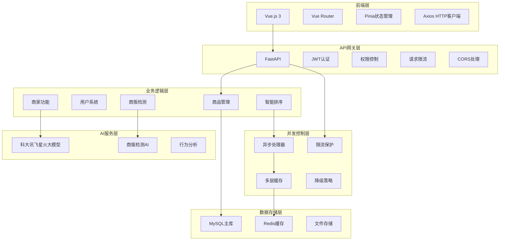
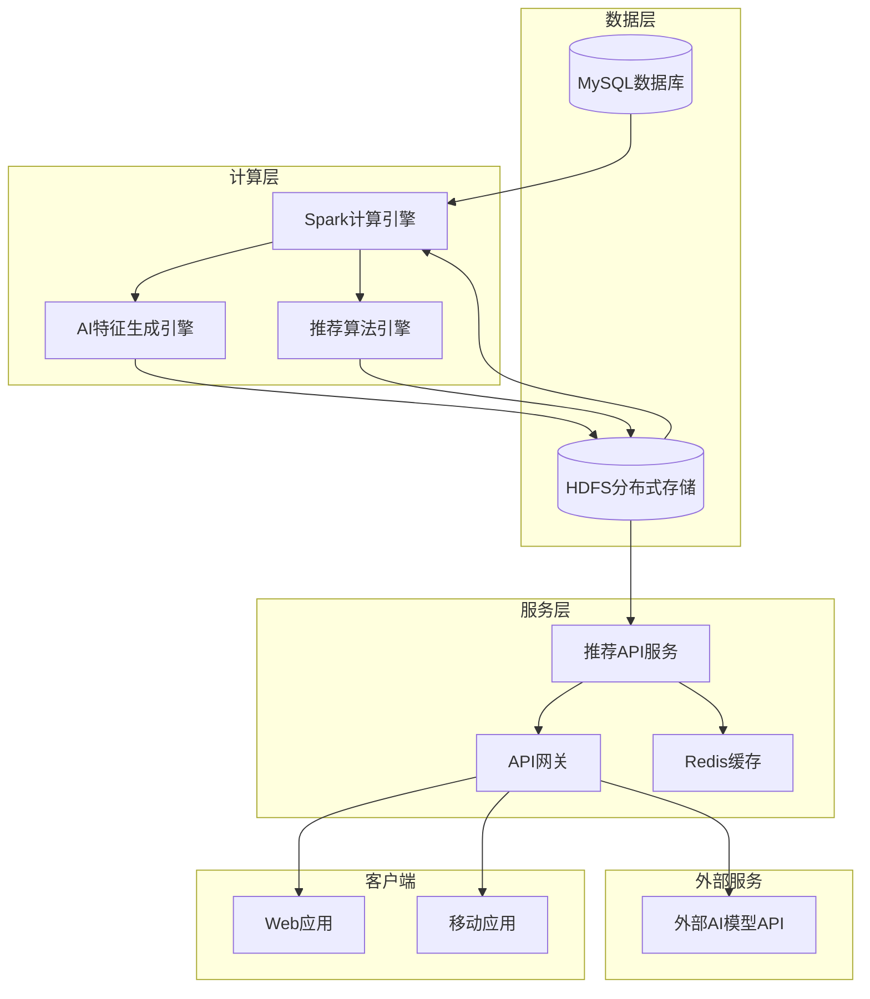
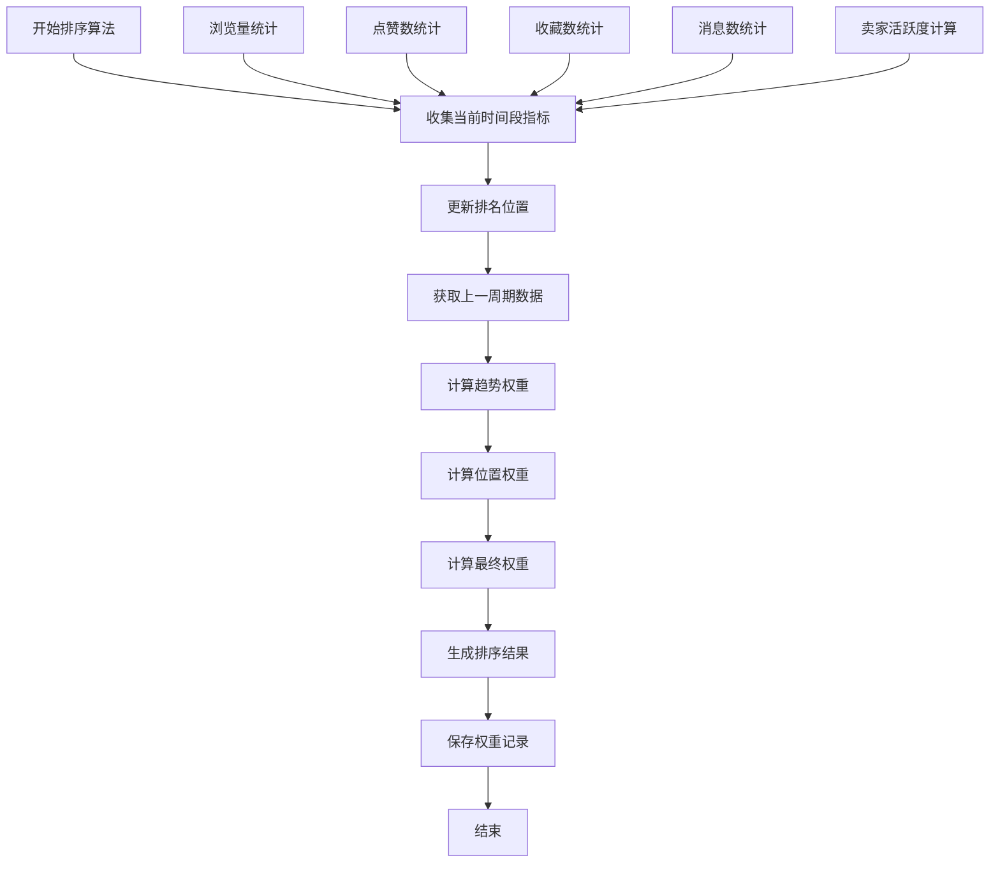
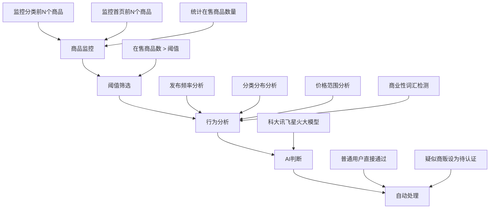
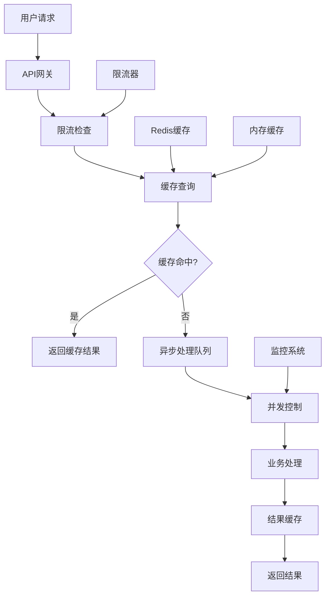
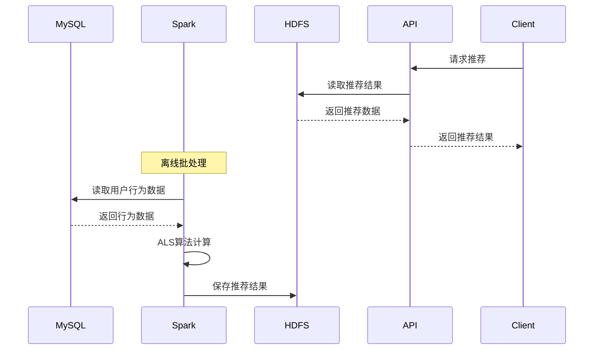
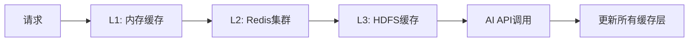
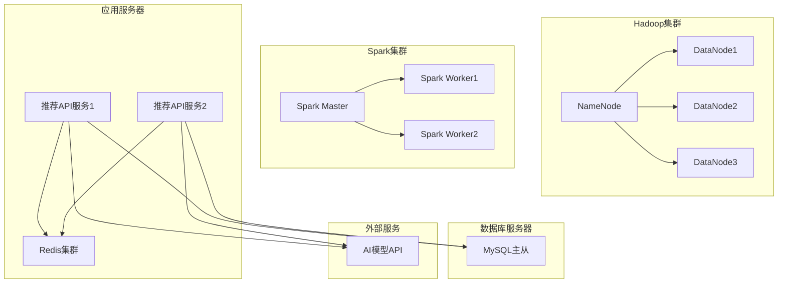

# 校园二手交易平台系统整体架构图

```mermaid
graph TB
    subgraph "前端层"
        A[Vue.js 3]
        B[Vue Router]
        C[Pinia状态管理]
        D[Axios HTTP客户端]
    end
    
    subgraph "API网关层"
        E[FastAPI]
        F[JWT认证]
        G[权限控制]
        H[请求限流]
        I[CORS处理]
    end
    
    subgraph "业务逻辑层"
        J[商品管理]
        K[用户系统]
        L[商家功能]
        M[智能排序]
        N[商贩检测]
    end
    
    subgraph "并发控制层"
        O[异步处理器]
        P[多层缓存]
        Q[限流保护]
        R[降级策略]
    end
    
    subgraph "AI服务层"
        S[科大讯飞星火大模型]
        T[商贩检测AI]
        U[行为分析]
    end
    
    subgraph "数据存储层"
        V[MySQL主库]
        W[Redis缓存]
        X[文件存储]
    end
    
    A --> E
    E --> J
    J --> V
    L --> S
    M --> O
    N --> T
    O --> P
    P --> W
    E --> Q
```

# 大数据与AI增强推荐系统架构图

```mermaid
graph TB
    subgraph "数据层"
        MySQL[(MySQL数据库)]
        HDFS[(HDFS分布式存储)]
    end
    
    subgraph "计算层"
        Spark[Spark计算引擎]
        AIEngine[AI特征生成引擎]
        RecEngine[推荐算法引擎]
    end
    
    subgraph "服务层"
        APIGateway[API网关]
        Cache[Redis缓存]
        WebAPI[推荐API服务]
    end
    
    subgraph "外部服务"
        AIModel[外部AI模型API]
    end
    
    subgraph "客户端"
        WebApp[Web应用]
        MobileApp[移动应用]
    end
    
    MySQL --> Spark
    HDFS --> Spark
    Spark --> AIEngine
    Spark --> RecEngine
    AIEngine --> HDFS
    RecEngine --> HDFS
    HDFS --> WebAPI
    WebAPI --> Cache
    WebAPI --> APIGateway
    APIGateway --> AIModel
    APIGateway --> WebApp
    APIGateway --> MobileApp
```

# 智能排序算法流程图

```mermaid
graph TD
    A[开始排序算法] --> B[收集当前时间段指标]
    B --> C[更新排名位置]
    C --> D[获取上一周期数据]
    D --> E[计算趋势权重]
    E --> F[计算位置权重]
    F --> G[计算最终权重]
    G --> H[生成排序结果]
    H --> I[保存权重记录]
    I --> J[结束]
    
    B1[浏览量统计] --> B
    B2[点赞数统计] --> B
    B3[收藏数统计] --> B
    B4[消息数统计] --> B
    B5[卖家活跃度计算] --> B
```

# 商贩检测流程图

```mermaid
graph TD
    A[商品监控] --> B[阈值筛选]
    B --> C[行为分析]
    C --> D[AI判断]
    D --> E[自动处理]
    
    A1[监控分类前N个商品] --> A
    A2[监控首页前N个商品] --> A
    A3[统计在售商品数量] --> A
    
    B1[在售商品数 > 阈值] --> B
    
    C1[发布频率分析] --> C
    C2[分类分布分析] --> C
    C3[价格范围分析] --> C
    C4[商业性词汇检测] --> C
    
    D1[科大讯飞星火大模型] --> D
    
    E1[普通用户直接通过] --> E
    E2[疑似商贩设为待认证] --> E
```

# 并发控制架构图

```mermaid
graph TB
    A[用户请求] --> B[API网关]
    B --> C[限流检查]
    C --> D[缓存查询]
    D --> E{缓存命中?}
    E -->|是| F[返回缓存结果]
    E -->|否| G[异步处理队列]
    G --> H[并发控制]
    H --> I[业务处理]
    I --> J[结果缓存]
    J --> K[返回结果]
    
    L[Redis缓存] --> D
    M[内存缓存] --> D
    N[限流器] --> C
    O[监控系统] --> H
```

# 推荐系统数据流架构图

```mermaid
sequenceDiagram
    participant MySQL
    participant Spark
    participant HDFS
    participant API
    participant Client

    Client->>API: 请求推荐
    API->>HDFS: 读取推荐结果
    HDFS-->>API: 返回推荐数据
    API-->>Client: 返回推荐结果

    Note over Spark: 离线批处理
    Spark->>MySQL: 读取用户行为数据
    MySQL-->>Spark: 返回行为数据
    Spark->>Spark: ALS算法计算
    Spark->>HDFS: 保存推荐结果
```

# 缓存架构图

```mermaid
graph LR
    A[请求] --> B[L1: 内存缓存]
    B --> C[L2: Redis集群]
    C --> D[L3: HDFS缓存]
    D --> E[AI API调用]
    E --> F[更新所有缓存层]
```

# 部署拓扑图

```mermaid
graph TB
    subgraph "Hadoop集群"
        NN[NameNode]
        DN1[DataNode1]
        DN2[DataNode2]
        DN3[DataNode3]
    end
    
    subgraph "Spark集群"
        SM[Spark Master]
        SW1[Spark Worker1]
        SW2[Spark Worker2]
    end
    
    subgraph "应用服务器"
        API1[推荐API服务1]
        API2[推荐API服务2]
        Cache[Redis集群]
    end
    
    subgraph "数据库服务器"
        MySQL[MySQL主从]
    end
    
    subgraph "外部服务"
        AIAPI[AI模型API]
    end
    
    NN --> DN1
    NN --> DN2
    NN --> DN3
    SM --> SW1
    SM --> SW2
    API1 --> Cache
    API2 --> Cache
    API1 --> MySQL
    API2 --> MySQL
    API1 --> AIAPI
    API2 --> AIAPI
```
